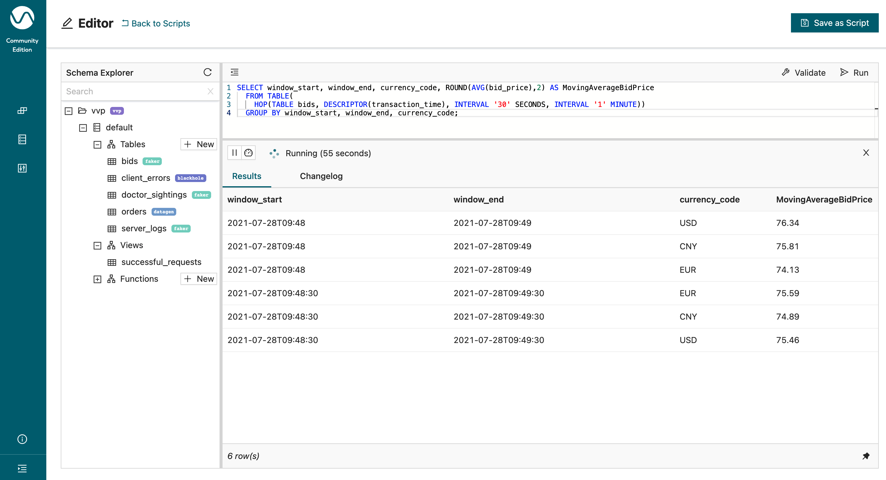

# 10 Hopping Time Windows


> :bulb: This example will show how to calculate a moving average in real-time using a `HOP` window.

The source table (`bids`) is backed by the [`faker` connector](https://flink-packages.org/packages/flink-faker), which continuously generates rows in memory based on Java Faker expressions.

In one of our previous recipes we've shown how you can [aggregate time series data](../01_group_by_window/01_group_by_window_tvf.md) using `TUMBLE`. 
To display every 30 seconds the moving average of bidding prices per currency per 1 minute, we will use the built-in `HOP` [function](https://ci.apache.org/projects/flink/flink-docs-stable/docs/dev/table/sql/queries/window-agg/).

The difference between a `HOP` and a `TUMBLE` function is that with a `HOP` you can "jump" forward in time. That's why you have to specify both the length of the window and the interval you want to jump forward. 
When using a `HOP` function, records can be assigned to multiple windows if the interval is smaller than the window length, like in this example. A tumbling window never overlaps and records will only belong to one window.  

## Script

```sql
CREATE TABLE bids ( 
    bid_id STRING,
    currency_code STRING,
    bid_price DOUBLE, 
    transaction_time TIMESTAMP(3),
    WATERMARK FOR transaction_time AS transaction_time - INTERVAL '5' SECONDS
) WITH (
  'connector' = 'faker',
  'fields.bid_id.expression' = '#{Internet.UUID}',
  'fields.currency_code.expression' = '#{regexify ''(EUR|USD|CNY)''}',
  'fields.bid_price.expression' = '#{Number.randomDouble ''2'',''1'',''150''}',
  'fields.transaction_time.expression' = '#{date.past ''30'',''SECONDS''}',
  'rows-per-second' = '100'
);

SELECT window_start, window_end, currency_code, ROUND(AVG(bid_price),2) AS MovingAverageBidPrice
  FROM TABLE(
    HOP(TABLE bids, DESCRIPTOR(transaction_time), INTERVAL '30' SECONDS, INTERVAL '1' MINUTE))
  GROUP BY window_start, window_end, currency_code;
```

## Example Output


